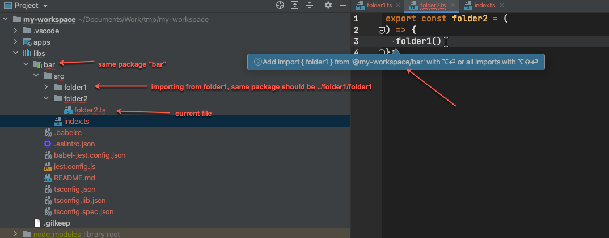
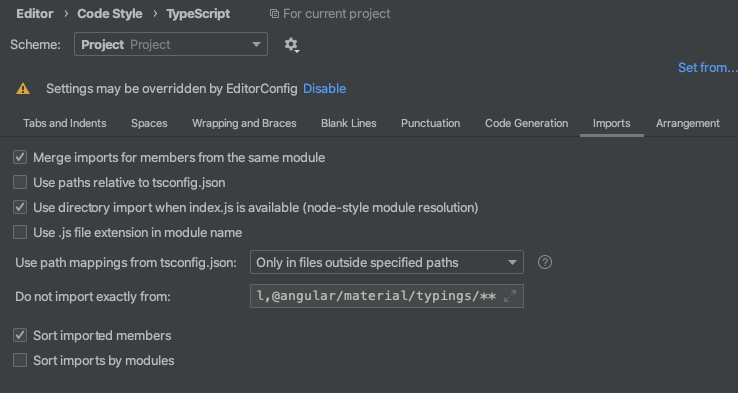
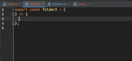

# Webstorm auto-import issue

### Gist
Import should happen relatively, as these 2 files are located in the same package

### My config
My current auto-import configuration is the following:

### How to reproduce

Navigate to `libs/bar/src/folder2/folder2.ts` and try importing `folder1` function.
Quick fix sometimes works fine, but it always bugs if you try to erase `folder1` and type it again.

